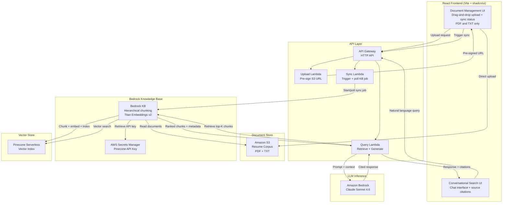

# talent-finder

Talent Finder is a full-stack, AI-powered portfolio project that ingests a corpus of resume, CV, and professional
profile documents into an AWS Bedrock Knowledge Base and exposes a conversational search interface for querying
candidates by skill, experience, and inferred seniority.

## About

Talent Finder is a full-stack, AI-powered application that ingests a corpus of resume, CV, and professional profile documents into an AWS Bedrock Knowledge Base and exposes a conversational search interface for querying candidates by skill, experience, and inferred seniority. Users upload PDF or TXT documents through a React-based management UI, triggering an S3-backed ingestion pipeline that chunks, embeds, and indexes content into a Pinecone Serverless vector store via Bedrock Knowledge Bases. Queries are handled via a Retrieve-then-Generate pattern — Bedrock retrieves relevant chunks, a prompt-engineered Lambda constructs a grounded reasoning request, and Claude Sonnet 4.6 generates cited, inference-aware responses. Talent Finder is the third installment in a portfolio trilogy (resume-lens → career-compass → Talent Finder), completing a coherent narrative spanning structured extraction, conversational coaching, and corpus-scale semantic retrieval. See the [Project Overview](./docs/PROJECT_OVERVIEW.md) for additional details.

## Architecture Overview

Talent Finder uses a two-workflow architecture: **document ingestion** and **conversational search**. Both workflows are powered by AWS Bedrock Knowledge Bases with Pinecone Serverless as the vector store.

### Ingestion Workflow

Users upload PDF or TXT documents through the React management UI using drag-and-drop. An upload Lambda pre-signs an S3 URL, allowing the frontend to upload directly to S3 for efficient large-file handling. A sync Lambda triggers a Bedrock Knowledge Base ingestion job, which reads from S3, applies hierarchical chunking, generates embeddings via Amazon Titan Embeddings v2, and indexes chunks into Pinecone Serverless. The Bedrock KB retrieves the Pinecone API key from AWS Secrets Manager to authenticate with the vector store. A status Lambda polls the sync job and returns per-document sync state to the UI.

### Query Workflow

The React chat UI sends natural-language queries to a query Lambda. The Lambda invokes the Bedrock KB Retrieve API, which performs vector search against Pinecone and returns the top-K ranked chunks with source metadata. The Lambda constructs a prompt with system instructions for seniority inference reasoning, retrieved chunks as context, and the user query, then invokes Claude Sonnet 4.6 via Bedrock's InvokeModel API. The response with source citations is returned to the UI.

### System Architecture Diagram



## Tech Stack

| Layer                  | Technology                                                                   | Rationale                                                                                                           |
| ---------------------- | ---------------------------------------------------------------------------- | ------------------------------------------------------------------------------------------------------------------- |
| **Frontend**           | React 19, Vite, React Router, TanStack Query, shadcn/ui, TailwindCSS, Lucide | Modern component-driven UI; TanStack Query for efficient server state management; shadcn/ui accelerates development |
| **API**                | AWS Lambda (Node.js/TypeScript) + API Gateway (HTTP API)                     | Serverless; minimal operational overhead; proven pattern across portfolio projects                                  |
| **Document Store**     | Amazon S3                                                                    | Native Bedrock KB data source; durable, cost-effective, event-driven ingestion pipeline                             |
| **Knowledge Base**     | Amazon Bedrock Knowledge Bases                                               | Managed RAG orchestration: hierarchical chunking, embedding generation, vector store sync                           |
| **Embedding Model**    | Amazon Titan Embeddings v2                                                   | Native Bedrock; 8K token window suits resume-length chunks; cost-effective                                          |
| **Vector Store**       | Pinecone Serverless                                                          | True scale-to-zero pricing (~$0–5/mo); no cold start; native Bedrock KB support                                     |
| **LLM Inference**      | Claude Sonnet 4.6 (via Amazon Bedrock)                                       | Latest Sonnet model; superior seniority inference capability                                                        |
| **Infrastructure**     | AWS CDK (TypeScript)                                                         | Full Infrastructure-as-Code; consistent with established project standards                                          |
| **Secrets Management** | AWS Secrets Manager                                                          | Required by Bedrock KB for Pinecone API key authentication                                                          |
| **Testing**            | Vitest, @testing-library                                                     | Unified test runner across monorepo; React Testing Library for UI assertions                                        |
| **CI/CD**              | GitHub Actions                                                               | Manual deploy gate via workflow dispatch; consistent with portfolio standards                                       |

## Getting Started

### Prerequisites

Before you begin, ensure you have the following installed on your machine:

- **Node.js** v24.15.0 or higher (v25 not supported)
- **npm** v10.0.0 or higher
- **Git** for version control

### Managing Node Versions with `nvm`

This project requires a specific Node.js version. If you work with multiple projects that require different Node versions, we recommend using **nvm** (Node Version Manager) to manage your Node installations. See the [official `nvm` docs](https://github.com/nvm-sh/nvm) for the latest installation instructions.

#### Installing nvm

**macOS / Linux:**

```bash
curl -o- https://raw.githubusercontent.com/nvm-sh/nvm/v0.40.4/install.sh | bash
```

Then restart your terminal or run: `source ~/.bashrc` or `source ~/.zshrc`

**Windows:**
Use [nvm-windows](https://github.com/coreybutler/nvm-windows/releases) (standalone installer)

#### Using nvm with this project

1. **Install the required Node version:**

   ```bash
   nvm install
   ```

2. **Switch to the correct version:**

   ```bash
   nvm use
   ```

3. **Verify the correct version is active:**
   ```bash
   node --version  # Should output v24.15.0
   npm --version   # Should output v10.0.0 or higher
   ```

**Tip:** The project includes a `.nvmrc` file in the root directory. If you have `nvm` installed, simply run `nvm use` from the project root to automatically switch to the correct Node version.

### Installation & Setup

1. **Clone the repository:**

   ```bash
   git clone https://github.com/mwarman/talent-finder.git
   cd talent-finder
   ```

2. **Set the Node.js Version**

   ```bash
   nvm use
   ```

3. **Install dependencies:**

   ```bash
   npm install
   ```

   This command installs all dependencies for the root project and all workspace packages (`web`, `api`, `shared`, `infra`).

4. **Start the development server:**
   ```bash
   npm run dev -w packages/web
   ```
   The web application will open automatically in your default browser at `http://localhost:5173`.

### Verifying Setup

To verify that everything is set up correctly, run the linter and tests:

```bash
npm run lint          # Check code quality
npm run test          # Run all tests across workspaces
npm run test:coverage # Generate coverage reports
```

## Available Scripts

All scripts are executed from the root directory using `npm run <script>` unless otherwise noted.

### Global Commands (Root)

| Script          | Description                                                                                              |
| --------------- | -------------------------------------------------------------------------------------------------------- |
| `build`         | Build all packages in the monorepo (`packages/web`, `packages/api`, `packages/shared`, `packages/infra`) |
| `clean`         | Remove `coverage/` and `dist/` directories from all packages                                             |
| `format`        | Format all code using Prettier                                                                           |
| `format:check`  | Check if code is formatted correctly without making changes                                              |
| `lint`          | Run ESLint across the entire monorepo                                                                    |
| `lint:fix`      | Run ESLint and automatically fix fixable issues                                                          |
| `test`          | Run all unit tests across all workspaces using Vitest                                                    |
| `test:coverage` | Run all tests and generate coverage reports for each workspace                                           |

### Web Package (`packages/web`)

| Script                                  | Description                                                           |
| --------------------------------------- | --------------------------------------------------------------------- |
| `npm run dev -w packages/web`           | Start the Vite development server with auto-reload (opens in browser) |
| `npm run preview -w packages/web`       | Preview the production build locally                                  |
| `npm run build -w packages/web`         | Build the React app for production                                    |
| `npm run clean -w packages/web`         | Remove coverage and dist directories                                  |
| `npm run test -w packages/web`          | Run web component and hook tests                                      |
| `npm run test:coverage -w packages/web` | Run tests and generate coverage report                                |

### API Package (`packages/api`)

| Script                                  | Description                            |
| --------------------------------------- | -------------------------------------- |
| `npm run build -w packages/api`         | Compile TypeScript Lambda handlers     |
| `npm run clean -w packages/api`         | Remove coverage and dist directories   |
| `npm run test -w packages/api`          | Run AWS Lambda handler tests           |
| `npm run test:coverage -w packages/api` | Run tests and generate coverage report |

### Infrastructure Package (`packages/infra`)

| Script                                    | Description                                                           |
| ----------------------------------------- | --------------------------------------------------------------------- |
| `npm run build -w packages/infra`         | Compile CDK infrastructure code                                       |
| `npm run cdk -w packages/infra`           | Run AWS CDK commands (e.g., `npm run cdk -w packages/infra -- synth`) |
| `npm run clean -w packages/infra`         | Remove coverage and dist directories                                  |
| `npm run test -w packages/infra`          | Run infrastructure stack tests                                        |
| `npm run test:coverage -w packages/infra` | Run tests and generate coverage report                                |

### Shared Package (`packages/shared`)

| Script                                     | Description                            |
| ------------------------------------------ | -------------------------------------- |
| `npm run build -w packages/shared`         | Compile shared utilities and types     |
| `npm run clean -w packages/shared`         | Remove coverage and dist directories   |
| `npm run test -w packages/shared`          | Run utility and type tests             |
| `npm run test:coverage -w packages/shared` | Run tests and generate coverage report |

## Documentation

The project documentation (`docs/`) is the source for all detailed project information such as: Architecture, Technologies,
DevOps, Configuration, etc.

- [**TABLE OF CONTENTS**](docs/README.md) - The table of contents for all project documentation.

## License

This project is licensed under the **MIT License**. See [LICENSE](LICENSE) for details.

## Author

**Matt Warman** — Portfolio project  
GitHub: [@mwarman](https://github.com/mwarman)  
Related: [resume-lens](https://github.com/mwarman/resume-lens), [career-compass](https://github.com/mwarman/resume-lens)
