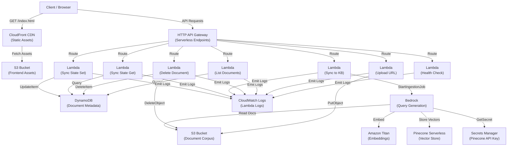

# Infrastructure Guide

## Overview

This guide covers deployment, configuration, and management of the Talent Finder infrastructure using AWS CDK. For CI/CD automation and workflow orchestration details, see [DevOps Guide](./DEVOPS_GUIDE.md).

## AWS Architecture Overview

Talent Finder is built on AWS serverless architecture with the following services working in concert:



### Service Rationale

**S3 Buckets (2 instances)**

- **Document Corpus Bucket:** Stores raw document files for ingestion into Bedrock Knowledge Base. S3 is chosen for durability (99.999999999%), versioning support (document history tracking), lifecycle management (archive to Glacier after 90 days for cost optimization), and native Bedrock integration (Knowledge Base data source).
- **Frontend Assets Bucket:** Stores the built React application. Combined with CloudFront for global distribution with low-latency, automatic compression, and Origin Access Control (OAC) for security.

**DynamoDB Table (Document Metadata)**

- Maintains document metadata (ID, upload timestamp, sync status). Chosen for its serverless, on-demand scaling (no capacity planning), millisecond query latency, and automatic backup/replication. PAY_PER_REQUEST billing aligns with unpredictable usage patterns.

**HTTP API Gateway (v2)**

- Serverless API endpoint for Lambda function routing. Chosen over REST API for lower cost, lower latency, and simpler configuration. Supports CORS natively for CloudFront origin.

**Lambda Functions (7 instances)**

- **Health Check:** Lightweight liveness probe for monitoring and load balancer health checks.
- **Upload URL Generator:** Issues pre-signed S3 PUT URLs to clients, allowing direct browser uploads without API Gateway bandwidth overhead.
- **List Documents:** Queries DynamoDB for document metadata and returns to client.
- **Delete Document:** Removes documents from S3 and DynamoDB, cleaning up corpus and metadata.
- **Sync Initiator:** Triggers Bedrock Knowledge Base ingestion jobs to embed documents into the vector store.
- **Sync State Get:** Retrieves the current sync state from DynamoDB, indicating whether a sync is needed.
- **Sync State Set:** Updates the sync state in DynamoDB, allowing clients to mark sync operations as complete.

Lambdas are chosen for their event-driven, pay-per-execution model, automatic scaling, and zero-management operation. Node.js runtime minimizes cold-start latency.

**Bedrock Knowledge Base**

- Orchestrates document embedding, chunking, and vector storage. Uses Amazon Titan Embeddings v2 (1024-dimensional vectors) for semantic understanding. Hierarchical chunking (parent: 1500 tokens, child: 300 tokens) balances context richness with retrieval precision. Bedrock is chosen as the managed embeddings/retrieval service, eliminating the need to manage embedding infrastructure.

**Pinecone Serverless (Vector Store)**

- Stores embeddings generated by Bedrock. Serverless model eliminates pod management. Chosen for fast similarity search, scalability, and native Bedrock integration via Knowledge Base data source.

**Secrets Manager**

- Securely stores Pinecone API key. Chosen to avoid committing secrets to version control and to enable automatic key rotation policies. Bedrock Knowledge Base retrieves the key at runtime via IAM role assumption.

**CloudWatch Logs**

- Aggregates Lambda function logs in a single log group with 7-day retention (dev/qa) or 30-day (prod). Chosen for centralized observability and CloudWatch Insights support for troubleshooting.

**CloudFront Distribution**

- CDN for frontend assets with Origin Access Control (OAC) enforcement, ensuring S3 bucket is not publicly accessible. Chosen for global distribution, automatic compression (gzip/brotli), and HTTP-to-HTTPS redirection.

## Prerequisites

- Node.js >= 24.15.0 < 25
- AWS CLI configured with appropriate credentials
- AWS account with permissions to create S3, Secrets Manager, CloudWatch, and Lambda resources

## Configuration

CDK configuration is managed through environment variables prefixed with `CDK_`. For local development, copy `.env.example` to `.env` and populate with your values:

```bash
cp packages/infra/.env.example packages/infra/.env
```

The `.env` file is automatically loaded when the CDK app runs, so no additional setup is required.

**Note:** All variables have sensible defaults. Variables with defaults do not need to be set unless you want to override them.

### Environment Variables

| Variable                     | Required | Default                          | Description                                                                                                                                                                                                                    |
| ---------------------------- | -------- | -------------------------------- | ------------------------------------------------------------------------------------------------------------------------------------------------------------------------------------------------------------------------------ |
| `CDK_APP_NAME`               | No       | `talent-finder`                  | Application name for resource tagging                                                                                                                                                                                          |
| `CDK_ENV_NAME`               | No       | `dev`                            | Environment identifier (`dev`, `qa`, or `prod`)                                                                                                                                                                                |
| `CDK_ORGANIZATION_UNIT`      | No       | `unknown`                        | Organization/OU for resource tagging                                                                                                                                                                                           |
| `CDK_RESOURCE_OWNER`         | No       | `unknown`                        | Team or person responsible for resources                                                                                                                                                                                       |
| `CDK_ACCOUNT`                | No       | —                                | AWS Account ID (optional, uses credential chain if omitted)                                                                                                                                                                    |
| `CDK_REGION`                 | No       | —                                | AWS Region (optional, uses credential chain if omitted)                                                                                                                                                                        |
| `CDK_LOG_LEVEL`              | No       | `info`                           | Lambda logging level (`trace`, `debug`, `info`, `warn`, `error`, or `fatal`)                                                                                                                                                   |
| `CDK_LOG_FORMAT`             | No       | `json`                           | Lambda logging format (`json` or `text`)                                                                                                                                                                                       |
| `CDK_LOG_ENABLED`            | No       | `true`                           | Enable Lambda logging (`true` or `false`)                                                                                                                                                                                      |
| `CDK_CLOUDFRONT_URL`         | No       | `*`                              | CloudFront distribution URL used as the allowed origin for S3 CORS policy. Set this to your CloudFront URL (e.g., `https://abc123.cloudfront.net`) to restrict uploads. Default (`*`) allows uploads from any origin for dev.  |
| `CDK_PINECONE_INDEX_HOST`    | **Yes**  | —                                | Pinecone Serverless index host URL (e.g., `https://index-name-xxx.svc.pinecone.io`). Obtained after completing [Manual Pinecone Setup](#manual-pinecone-setup).                                                                |
| `CDK_PINECONE_API_KEY`       | **Yes**  | —                                | Pinecone API key. Written into Secrets Manager at deploy time. Bedrock validates this key when provisioning the Knowledge Base — deploy will fail with an invalid key. **Treat as a secret; never commit to version control.** |
| `CDK_BEDROCK_MODEL_ID`       | No       | `us.anthropic.claude-sonnet-4-6` | Bedrock model ID for query generation. Supports geo-inference models (e.g., `us.anthropic.claude-sonnet-4-6`) which may be invoked in multiple regions.                                                                        |
| `CDK_BEDROCK_RETRIEVE_TOP_K` | No       | `5`                              | Number of top chunks to retrieve from Knowledge Base for query context                                                                                                                                                         |
| `CDK_BEDROCK_MAX_TOKENS`     | No       | `1500`                           | Maximum tokens in model response for query generation                                                                                                                                                                          |

### AWS Credentials

AWS credentials are sourced from the standard credential chain in the following order:

1. `AWS_ACCESS_KEY_ID` and `AWS_SECRET_ACCESS_KEY` environment variables
2. `~/.aws/credentials` file
3. IAM instance profile (when running on EC2, Lambda, ECS, etc.)

**Important:** AWS credentials are **NOT** read from the `.env` file. Set them via environment variables or AWS configuration files.

## Deployment

### 1. Install Dependencies

```bash
npm install
```

### 2. Set Configuration

**Option 1: Use `.env` file (recommended for local development)**

```bash
cp packages/infra/.env.example packages/infra/.env
# Edit packages/infra/.env and set your values
```

The `.env` file is automatically loaded by the CDK app.

> **Prerequisites before deploying:** `CDK_PINECONE_INDEX_HOST` and `CDK_PINECONE_API_KEY` must be set to valid values. The Pinecone index must exist and the API key must be active — Bedrock validates both during Knowledge Base provisioning and the deploy will fail otherwise. Complete [Manual Pinecone Setup](#manual-pinecone-setup) first.

**Option 2: Export environment variables**

```bash
export CDK_ENV_NAME=dev
export CDK_ORGANIZATION_UNIT=engineering
export CDK_RESOURCE_OWNER=team-backend
```

If no values are provided, the defaults will be used (`dev` environment, `unknown` for organization and owner).

### 3. Build Infrastructure Package

```bash
npm run build -w packages/infra
```

This compiles TypeScript to JavaScript in the `dist/` directory. CDK requires the compiled output since it runs `node dist/app.js`.

### 4. Synthesize CloudFormation Template

```bash
npm run cdk synth -w packages/infra
```

This generates a CloudFormation template in `cdk.out/` and validates the stack definition.

### 5. Deploy Backend Stack to AWS

```bash
npm run cdk deploy -w packages/infra BackendStack
```

CDK will show a preview of resources to be created. Review and confirm (press `y`) to proceed.

### 6. Verify Backend Stack

After successful Backend Stack deployment, AWS CloudFormation outputs will include:

- **S3 Bucket Name:** Document corpus storage
- **Secret ARN:** Pinecone API key location in Secrets Manager
- **Log Group Name:** CloudWatch log group for Lambda functions
- **Knowledge Base ID:** Bedrock Knowledge Base identifier (used by retrieval Lambdas)
- **Data Source ID:** Bedrock Knowledge Base S3 data source identifier
- **API Endpoint URL:** HTTP API Gateway endpoint for Lambda functions

## Frontend Stack Deployment

The **FrontendStack** provisions CloudFront and S3 for static hosting of the React web application. It must be deployed in a separate step after the Backend Stack and after building the web package with the API endpoint URL.

### Deployment Sequence

1. **Deploy Backend Stack** (as described above)
2. **Obtain the API Gateway endpoint URL** from Backend Stack CloudFormation outputs:

   ```bash
   aws cloudformation describe-stacks \
     --stack-name talent-finder-backend-dev \
     --query 'Stacks[0].Outputs[?OutputKey==`APIGatewayUrl`].OutputValue' \
     --output text
   ```

3. **Build the web package** with the API URL injected at build time:

   ```bash
   export VITE_API_BASE_URL=<api-gateway-endpoint-from-step-2>
   npm run build -w packages/web
   ```

4. **Deploy the Frontend Stack:**

   ```bash
   npm run cdk deploy -w packages/infra FrontendStack
   ```

### Frontend Stack Configuration

The FrontendStack automatically syncs the built web package from `packages/web/dist` to S3. Ensure the web package is built with the API endpoint URL before deploying:

```bash
# Build the web package with API endpoint
export VITE_API_BASE_URL=<your-api-endpoint-url>
npm run build -w packages/web

# Deploy frontend stack
npm run cdk deploy -w packages/infra
```

### Frontend Stack Resources

#### S3 Bucket (Frontend Assets)

- **Bucket Name:** `{app-name}-frontend-{env-name}` (e.g., `talent-finder-frontend-dev`)
- **Encryption:** Server-side encryption with S3-managed keys (SSE-S3)
- **Block Public Access:** All public access blocked (CloudFront-only access via OAC)
- **Versioning:** Disabled (CloudFront invalidation used instead)
- **Lifecycle Rules:** Old object versions expire after 7 days; objects expire after 30 days
- **Removal Policy:** Retained in production, auto-deleted in dev/qa

#### CloudFront Distribution

- **Origin:** S3 bucket accessed via Origin Access Control (OAC)
- **Default Root Object:** `index.html`
- **Caching Policy:** CloudFront Optimized (efficient asset caching)
- **Compression:** Enabled (gzip/brotli)
- **HTTP/HTTPS:** HTTP redirects to HTTPS
- **Custom Error Responses:** 403 and 404 errors → `/index.html` (200 OK) for SPA client-side routing
- **Price Class:** PRICE_CLASS_100 (cost-optimized, excludes expensive regions)
- **Outputs:** `TalentFinder-FrontendUrl-{env}`, `TalentFinder-FrontendDistributionId-{env}`

#### BucketDeployment

- Automatically syncs the web package from `packages/web/dist` to S3 during stack deployment
- Invalidates CloudFront cache (`/*`) after upload to ensure new assets are served immediately
- Removes old assets that are no longer in the new build

## Manual Pinecone Setup

The Bedrock Knowledge Base uses Pinecone Serverless as its vector store. The index must be created manually before running `cdk deploy` because CDK cannot provision Pinecone resources directly.

### Steps

1. **Create a Pinecone account** at [pinecone.io](https://pinecone.io) if you do not have one.

2. **Create a Serverless index** with the following settings:

   | Setting      | Value                 | Notes                                                                    |
   | ------------ | --------------------- | ------------------------------------------------------------------------ |
   | Index name   | Any                   | Choose a descriptive name, e.g. `talent-finder-dev`                      |
   | Dimensions   | **1024**              | Required for Amazon Titan Embeddings v2 (`amazon.titan-embed-text-v2:0`) |
   | Metric       | **cosine**            | Required for semantic similarity search                                  |
   | Cloud/Region | Match your AWS region | Reduces latency and egress costs                                         |

3. **Copy the index host URL** from the Pinecone console (format: `https://index-name-xxx-yyy.svc.pinecone.io`).

4. **Copy the API key** from the Pinecone console.

5. **Set the Pinecone API key** as a configuration variable before deploying:

   ```bash
   # Local development (.env file)
   echo 'CDK_PINECONE_API_KEY=<your-pinecone-api-key>' >> packages/infra/.env
   ```

   For CI/CD deployments, add `CDK_PINECONE_API_KEY=<your-key>` to the `CDK_ENV` GitHub Actions secret — see [docs/DEVOPS_GUIDE.md](./DEVOPS_GUIDE.md).

   CDK writes the key to Secrets Manager in the correct `{"apiKey":"..."}` JSON format at deploy time. **Do not commit the API key to version control.**

   > **Important:** Bedrock validates the Pinecone API key when provisioning the Knowledge Base. The deploy will fail if the key is missing, empty, or invalid.

6. **Set the index host URL** as an environment variable before deploying:

   ```bash
   export CDK_PINECONE_INDEX_HOST='https://index-name-xxx-yyy.svc.pinecone.io'
   ```

   Or add it to `packages/infra/.env`:

   ```
   CDK_PINECONE_INDEX_HOST=https://index-name-xxx-yyy.svc.pinecone.io
   ```

7. **(Optional) Configure Bedrock Model and Retrieval Parameters:**

   You can customize the Bedrock model and retrieval behavior by setting additional environment variables:

   ```bash
   # Use a different Bedrock model (default: us.anthropic.claude-sonnet-4-6)
   export CDK_BEDROCK_MODEL_ID='us.anthropic.claude-opus-4-1'

   # Adjust number of chunks to retrieve (default: 5)
   export CDK_BEDROCK_RETRIEVE_TOP_K=10

   # Adjust maximum tokens in model response (default: 1500)
   export CDK_BEDROCK_MAX_TOKENS=2000
   ```

## Stack Resources

### S3 Bucket (Document Corpus)

- **Versioning:** Enabled for change tracking and recovery
- **Encryption:** Server-side encryption with S3-managed keys (SSE-S3)
- **CORS Configuration:** Enabled for the CloudFront distribution URL (set via `CDK_CLOUDFRONT_URL`), allowing PUT requests for document uploads
- **Lifecycle Rule:** Objects automatically transitioned to Glacier after 90 days
- **Removal Policy:** Retained in production, auto-deleted in dev/qa

### DynamoDB Table (Document Metadata)

- **Table Name:** `{app-name}-documents-{env-name}`
- **Partition Key:** `documentId` (STRING)
- **Billing Mode:** PAY_PER_REQUEST (on-demand scaling)
- **Removal Policy:** Retained in production, auto-deleted in dev/qa

### Lambda Functions

#### Health Check Lambda

- **Route:** `GET /health`
- **Purpose:** Health check endpoint for API monitoring
- **Memory:** 128 MB
- **Timeout:** 6 seconds

#### Upload Lambda

- **Route:** `POST /documents/upload-url`
- **Purpose:** Generates pre-signed S3 PUT URLs for client-side document uploads
- **Memory:** 512 MB
- **Timeout:** 10 seconds
- **Permissions:** `s3:PutObject` (scoped to `documents/*`), `dynamodb:ReadWriteData` (Documents table)

#### Documents List Lambda

- **Route:** `GET /documents`
- **Purpose:** Retrieves all documents from DynamoDB
- **Memory:** 256 MB
- **Timeout:** 10 seconds
- **Permissions:** `dynamodb:GetItem`, `dynamodb:Query`, `dynamodb:Scan` (Documents table)

#### Document Delete Lambda

- **Route:** `DELETE /documents/{id}`
- **Purpose:** Deletes document from S3 and DynamoDB
- **Memory:** 256 MB
- **Timeout:** 10 seconds
- **Permissions:** `s3:GetObject`, `s3:DeleteObject` (scoped to `documents/*`), `dynamodb:ReadWriteData` (Documents table)

#### Sync Start Lambda

- **Route:** `POST /documents/sync`
- **Purpose:** Initiates synchronization of a document to Bedrock Knowledge Base
- **Memory:** 512 MB
- **Timeout:** 30 seconds
- **Permissions:** `dynamodb:ReadWriteData` (Documents table), `bedrock:StartIngestionJob` (Knowledge Base data source)

#### Sync State Get Lambda

- **Route:** `GET /sync-state`
- **Purpose:** Retrieves the current sync state for the Knowledge Base. Returns `{ syncNeeded: true }` by default when no state exists, indicating that a sync may be required.
- **Memory:** 256 MB
- **Timeout:** 6 seconds
- **Permissions:** `dynamodb:GetItem` (Documents table)

#### Sync State Set Lambda

- **Route:** `PUT /sync-state`
- **Purpose:** Updates the sync state in DynamoDB. Clients use this to mark sync operations as complete by sending `{ syncNeeded: false }`.
- **Memory:** 256 MB
- **Timeout:** 6 seconds
- **Permissions:** `dynamodb:PutItem` (Documents table)
- **Request Body:** `{ syncNeeded: boolean }`
- **Response:** `{ syncNeeded: boolean }`

### HTTP API Gateway

- **Type:** AWS HTTP API (v2)
- **Routes:** Wired to Lambda functions as described above
- **CORS:** Configured to allow requests from CloudFront distribution

### CloudWatch Log Group

- **Name:** `/aws/lambda/{app-name}-{env-name}` (shared by all Lambda functions)
- **Retention:** 7 days in dev/qa, 30 days in production
- **Removal Policy:** Auto-deleted in dev/qa, retained in production

### Secrets Manager Secret

- **Name:** `talent-finder/{env-name}/pinecone-api-key`
- **Value:** Written at deploy time from `CDK_PINECONE_API_KEY` as `{"apiKey":"<key>"}` (JSON format required by Bedrock)
- **Rotation:** To rotate the key, update `CDK_PINECONE_API_KEY` and redeploy. CDK will update the secret in place.

### Bedrock Knowledge Base

- **Embedding Model:** Amazon Titan Embeddings v2 (`amazon.titan-embed-text-v2:0`) — produces 1024-dimensional vectors
- **Vector Store:** Pinecone Serverless (connection string from `CDK_PINECONE_INDEX_HOST`)
- **IAM Execution Role:** Grants the Bedrock service `s3:GetObject`, `s3:ListBucket` (documents bucket), `secretsmanager:GetSecretValue` (Pinecone secret), and `bedrock:InvokeModel` (Titan Embeddings v2)
- **Outputs:** `TalentFinder-KnowledgeBaseId-{env}`, `TalentFinder-DataSourceId-{env}`

#### Bedrock Knowledge Base Data Source

- **Source:** S3 bucket, `documents/` prefix
- **Chunking Strategy:** Hierarchical

  | Parameter               | Value    | Notes                                       |
  | ----------------------- | -------- | ------------------------------------------- |
  | Parent chunk max tokens | **1500** | Broad context for richer answer generation  |
  | Child chunk max tokens  | **300**  | Fine-grained unit for precise retrieval     |
  | Overlap tokens          | **60**   | Continuity across adjacent chunk boundaries |

  These values are tunable via the `levelConfigurations` and `overlapTokens` fields in `packages/infra/src/stacks/backend-stack.ts`.

## Destruction

### 1. Build Infrastructure Package

Before destroying, ensure the latest build is available:

```bash
npm run build -w packages/infra
```

### 2. Empty S3 Bucket

**Important:** S3 buckets must be empty before stack deletion. Remove all objects:

```bash
aws s3 rm s3://<bucket-name> --recursive
```

### 3. Destroy Stack

```bash
npm run cdk destroy -w packages/infra
```

CDK will confirm resource deletion. Press `y` to proceed.

### 4. Clean Up Pinecone Index (Optional)

The Bedrock Knowledge Base is deleted by CDK, but the Pinecone Serverless index is **not** automatically destroyed since it's managed outside of CDK. Manually delete the index if you no longer need it:

1. **Sign in to Pinecone console** at [pinecone.io](https://pinecone.io)
2. **Navigate to your project** and select the index you created for this environment
3. **Delete the index** using the console UI or API

**Note:** Deleting the index will permanently erase all stored vectors. Ensure this is intentional before proceeding.

## Useful CDK Commands

| Command                                 | Purpose                                        |
| --------------------------------------- | ---------------------------------------------- |
| `npm run build -w packages/infra`       | Compile TypeScript to JavaScript               |
| `npm run cdk synth -w packages/infra`   | Generate CloudFormation template               |
| `npm run cdk deploy -w packages/infra`  | Deploy stack to AWS                            |
| `npm run cdk destroy -w packages/infra` | Delete stack and resources                     |
| `npm run cdk diff -w packages/infra`    | Show changes between local and deployed stacks |
| `npm run cdk events -w packages/infra`  | Stream CloudFormation events during deployment |

## Troubleshooting

### Configuration Validation Error

**Error:** `Configuration validation error: - CDK_ENV_NAME (Invalid enum value...)`

**Solution:** Verify `CDK_ENV_NAME` is set to one of the valid values: `dev`, `qa`, or `prod`. All other configuration variables have defaults:

```bash
export CDK_ENV_NAME=dev
# CDK_ORGANIZATION_UNIT and CDK_RESOURCE_OWNER default to 'unknown' if not set
# CDK_APP_NAME defaults to 'talent-finder' if not set
```

If you want to override the defaults:

```bash
export CDK_ORGANIZATION_UNIT=engineering
export CDK_RESOURCE_OWNER=team-backend
```

### AWS Credentials Not Found

**Error:** `UnrecognizedClientException: The security token included in the request is invalid`

**Solution:** Verify AWS credentials are configured:

```bash
# Check environment variables
echo $AWS_ACCESS_KEY_ID

# Or verify ~/.aws/credentials exists and has a profile
cat ~/.aws/credentials
```

### S3 Bucket Not Empty

**Error:** `S3 bucket must be empty before deletion`

**Solution:** Remove all objects from S3:

```bash
aws s3 rm s3://<bucket-name> --recursive
```

### Deployment Approval Required

If CDK requires approval for resource changes:

```bash
npm run cdk deploy -w packages/infra --require-approval=never
```

## Next Steps

Once the base stack is deployed:

1. **Complete Manual Pinecone Setup:** Create the Serverless index and copy the API key into Secrets Manager — see [Manual Pinecone Setup](#manual-pinecone-setup).
2. **Set `CDK_PINECONE_INDEX_HOST`:** (Optional - If not already set.) Export the Pinecone index host URL and redeploy to provision the Bedrock Knowledge Base.

## Related Documentation

- [DevOps Guide](./DEVOPS_GUIDE.md) — CI/CD workflows, GitHub Actions, and deployment automation
- [Project Overview](./PROJECT_OVERVIEW.md) — Monorepo structure and application architecture
- [AWS CDK Documentation](https://docs.aws.amazon.com/cdk/v2/guide/)
- [AWS CloudFormation User Guide](https://docs.aws.amazon.com/cloudformation/)
- [Bedrock Knowledge Bases](https://docs.aws.amazon.com/bedrock/latest/userguide/knowledge-base.html)
- [Pinecone Serverless](https://docs.pinecone.io/guides/projects/serverless)
