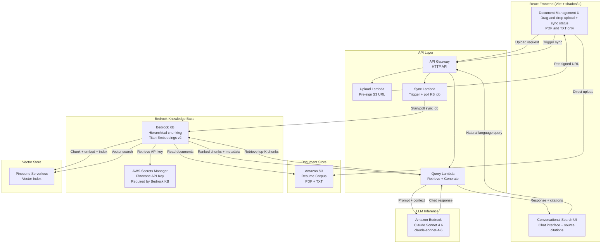

# Project Overview: Talent Finder

**Version:** Draft 4  
**Date:** 2026-05-21  
**Project Type:** Both (Upskilling + Portfolio)  
**Status:** Approved for Planning

---

## Executive Summary

Talent Finder is a full-stack, AI-powered application that ingests a corpus of resume, CV, and professional profile documents into an AWS Bedrock Knowledge Base and exposes a conversational search interface for querying candidates by skill, experience, and inferred seniority. Users upload PDF or TXT documents through a React-based management UI, triggering an S3-backed ingestion pipeline that chunks, embeds, and indexes content into a Pinecone Serverless vector store via Bedrock Knowledge Bases. Queries are handled via a Retrieve-then-Generate pattern — Bedrock retrieves relevant chunks, a prompt-engineered Lambda constructs a grounded reasoning request, and Claude Sonnet 4.6 generates cited, inference-aware responses. Talent Finder is the third installment in a portfolio trilogy (resume-lens → career-compass → Talent Finder), completing a coherent narrative spanning structured extraction, conversational coaching, and corpus-scale semantic retrieval.

---

## Goals

- **Primary Goal:** Build and deeply understand a production-pattern RAG pipeline on AWS Bedrock — from document ingestion through hierarchical chunking, semantic retrieval, and prompt-engineered response generation.
- **Secondary Goals:**
  - Complete the resume/recruiting AI portfolio trilogy with a coherent narrative arc
  - Demonstrate AWS Bedrock Knowledge Bases, Pinecone Serverless, and CDK-managed infrastructure to enterprise clients and technical evaluators
  - Explore prompt engineering for inference over retrieved context: seniority estimation, skill depth reasoning from unstructured text
  - Establish a reusable RAG architecture pattern applicable to future client engagements

---

## Scope

### In Scope

- Document upload UI: drag-and-drop ingestion of resume/CV/profile documents (PDF and TXT only)
- S3-backed document store with per-document metadata (filename, upload date, sync status)
- Bedrock Knowledge Base with hierarchical chunking and Amazon Titan Embeddings v2
- Pinecone Serverless as the vector store (configured as a native Bedrock KB external vector store; API key stored in AWS Secrets Manager)
- Ingestion sync pipeline: S3 → Bedrock KB sync job → Pinecone Serverless index
- Ingestion status tracking: per-document sync state visible in the management UI
- Conversational search interface: natural-language queries with LLM-generated, retrieval-grounded responses
- Retrieve-then-Generate query pattern: retrieved chunks injected into a prompt-engineered reasoning request to Claude
- Source attribution: responses cite which resume(s) contributed to the answer
- Generation model: Claude Sonnet 4.6 (`claude-sonnet-4-6`) configurable via environment variable
- Full IaC via AWS CDK (TypeScript): S3, Bedrock KB, Lambda, API Gateway, Secrets Manager
- GitHub Actions CI/CD with manual deploy gate (workflow dispatch)
- Single production environment

### Out of Scope

- DOCX document support (PDF and TXT only; consistent with resume-lens)
- Authentication / multi-tenancy (single-user demo; intentional scope exclusion)
- Production-grade PII handling or GDPR compliance (demo corpus only)
- Resume parsing for structured data export (resume-lens territory)
- Candidate ranking, scoring, or recommendation engine
- Integration with ATS or HRIS systems
- Multi-environment topology (dev/staging/prod)
- VPC / private networking (not required; Lambda runs outside VPC)
- SSM Parameter Store for Pinecone API key (Bedrock KB requires Secrets Manager; not substitutable)
- **Stretch Goal (explicit, not forgotten):** Pre-ingestion metadata extraction Lambda for hybrid retrieval with structured skill/seniority filters (Option B)

---

## Target Audience

| Audience                               | Signal Being Demonstrated                                                                                                      |
| -------------------------------------- | ------------------------------------------------------------------------------------------------------------------------------ |
| Enterprise IT / HR tech clients        | Production-pattern RAG pipeline design on AWS; informed vendor selection (right tool for the job over AWS-native-at-all-costs) |
| Technical recruiters / hiring managers | Deep AWS Bedrock + CDK fluency; full-stack TypeScript at architectural scale                                                   |
| Peer architects                        | Hierarchical chunking strategy; Retrieve-then-Generate prompt architecture; cost-optimized vector store selection              |

---

## Technology Stack

| Layer           | Technology / Service                                                         | Rationale                                                                                                                                |
| --------------- | ---------------------------------------------------------------------------- | ---------------------------------------------------------------------------------------------------------------------------------------- |
| Frontend        | React 19, Vite, React Router, TanStack Query, shadcn/ui, TailwindCSS, Lucide | Consistent with established project stack; component library accelerates UI                                                              |
| API             | AWS Lambda (Node.js/TypeScript) + API Gateway (HTTP API)                     | Serverless; consistent with prior projects; minimal ops overhead                                                                         |
| Document Store  | Amazon S3                                                                    | Native Bedrock KB data source; durable, cost-effective, event-driven sync                                                                |
| Knowledge Base  | Amazon Bedrock Knowledge Bases                                               | Managed RAG pipeline: hierarchical chunking, embedding orchestration, sync                                                               |
| Embedding Model | Amazon Titan Embeddings v2                                                   | Native Bedrock; 8K token window suits resume-length chunks; cost-effective                                                               |
| Vector Store    | Pinecone Serverless                                                          | ~$0–5/mo at demo scale (free tier likely sufficient); true scale-to-zero; no cold start; native Bedrock KB support                       |
| LLM Inference   | Amazon Bedrock — Claude Sonnet 4.6 (`claude-sonnet-4-6`)                     | Latest Sonnet model on Bedrock; highest quality for seniority inference; configurable via `BEDROCK_MODEL_ID` env var                     |
| Infrastructure  | AWS CDK (TypeScript)                                                         | Consistent with established project stack; full IaC                                                                                      |
| Secrets         | AWS Secrets Manager                                                          | Stores Pinecone API key; **required by Bedrock KB** for external vector store authentication; not substitutable with SSM Parameter Store |
| Observability   | AWS CloudWatch + structured logging (Pino in Lambda)                         | Native AWS; zero additional tooling cost                                                                                                 |
| CI/CD           | GitHub Actions (manual deploy gate via workflow dispatch)                    | Consistent with prior projects; intentional deploy control                                                                               |

---

## Architecture Overview

The system has two distinct runtime workflows sharing a common infrastructure layer.

**Ingestion workflow:** The React frontend allows document upload via drag-and-drop (PDF and TXT only). An upload Lambda pre-signs an S3 URL; the frontend uploads directly to S3 (bypassing Lambda for large file handling). A sync Lambda triggers a Bedrock KB ingestion job, which reads from S3, applies hierarchical chunking, generates embeddings via Titan v2, and indexes chunks into Pinecone Serverless. Bedrock KB retrieves the Pinecone API key from Secrets Manager to authenticate with the index. A status Lambda polls the Bedrock KB sync job and returns per-document sync state to the UI.

**Query workflow:** The React chat UI sends a natural-language query to a query Lambda. The Lambda invokes the Bedrock KB Retrieve API, which performs vector search against Pinecone and returns the top-K ranked chunks with source metadata. The Lambda constructs a prompt — system instructions for seniority inference reasoning + retrieved chunks as context + user query — and invokes Claude Sonnet 4.6 via the Bedrock InvokeModel API. The response, with source citations, is returned to the UI.

Lambda functions run outside a VPC. API Gateway (HTTP API) fronts all Lambda functions. CDK manages the full infrastructure graph.

### Architecture Diagram

---

## Key Design Decisions

### Decision: Vector Store — Pinecone Serverless vs. Aurora pgvector vs. OpenSearch Serverless

| Option                                     | Monthly Cost (Demo Scale)           | Idle Cost       | Cold Start            | Setup Complexity                         | Bedrock KB Support |
| ------------------------------------------ | ----------------------------------- | --------------- | --------------------- | ---------------------------------------- | ------------------ |
| Pinecone Serverless                        | ~$0–5 (free tier likely sufficient) | $0              | None                  | Low (index + API key in Secrets Manager) | Native             |
| Aurora PostgreSQL Serverless v2 + pgvector | ~$50–65                             | ~$42/mo minimum | 5–40s (scale-to-zero) | High (VPC, RDS, Lambda VPC placement)    | Native             |
| Amazon OpenSearch Serverless               | ~$700                               | ~$700/mo        | None                  | Low (fully managed)                      | Native (default)   |

**Decision:** Pinecone Serverless

**Rationale:** For a portfolio demo app that will run long-term, cost optimization is a first-class architectural constraint. Pinecone Serverless eliminates idle cost entirely (true scale-to-zero with no cold start penalty), is a natively supported Bedrock KB vector store, and reduces CDK complexity by removing the VPC and RDS stack. The vendor selection decision — choosing the right tool over staying AWS-native at all costs — is itself a documentable architectural trade-off that strengthens the portfolio narrative.

---

### Decision: Secrets Manager vs. SSM Parameter Store for Pinecone API Key

| Option              | Cost                                                 | Bedrock KB Compatible | Notes                                                                                    |
| ------------------- | ---------------------------------------------------- | --------------------- | ---------------------------------------------------------------------------------------- |
| AWS Secrets Manager | ~$0.40/mo + negligible API call cost                 | **Yes — required**    | `credentialsSecretArn` is a required field in the Bedrock KB `PineconeConfiguration` API |
| SSM Parameter Store | ~$0.05/mo (Standard tier free; Advanced $0.05/param) | **No**                | Bedrock KB does not accept SSM ARNs for vector store credentials                         |

**Decision:** AWS Secrets Manager

**Rationale:** Not a choice — Bedrock KB's `PineconeConfiguration` API requires a Secrets Manager ARN in the `credentialsSecretArn` field. SSM Parameter Store cannot be substituted. Cost impact is negligible (~$0.40–0.50/mo).

---

### Decision: Chunking Strategy — Hierarchical vs. Fixed-Size vs. Semantic

| Option                  | Retrieval Precision                   | Context for Inference                          | Resume Fit                                                         |
| ----------------------- | ------------------------------------- | ---------------------------------------------- | ------------------------------------------------------------------ |
| Hierarchical            | High — child chunks for precise match | High — parent chunks returned for full context | Best — handles heterogeneous resume structure                      |
| Fixed-size with overlap | Medium — may split mid-section        | Medium — overlap helps but incomplete          | Acceptable starting point                                          |
| Semantic                | Medium — good for narrative flow      | Medium                                         | Weak — resume sections are already short and structurally distinct |

**Decision:** Hierarchical chunking

**Rationale:** Resume seniority inference requires both retrieval precision (find the right candidate/skill) and sufficient surrounding context (infer years from date ranges and role descriptions). Hierarchical chunking is the only strategy that delivers both without trade-off.

---

### Decision: Retrieval API Pattern — Retrieve-then-Generate vs. RetrieveAndGenerate

| Option                             | Prompt Control                                                     | Complexity | Seniority Inference Quality                                 |
| ---------------------------------- | ------------------------------------------------------------------ | ---------- | ----------------------------------------------------------- |
| Retrieve-then-Generate (two calls) | Full — custom system prompt, reasoning instructions, output format | Medium     | High — explicit reasoning chain injectable                  |
| RetrieveAndGenerate (single call)  | Low — limited system prompt customization                          | Low        | Medium — inference instructions cannot be reliably injected |

**Decision:** Retrieve-then-Generate

**Rationale:** Seniority inference from unstructured resume text requires explicit reasoning instructions ("analyze job date ranges, infer years per skill, express uncertainty when evidence is insufficient"). RetrieveAndGenerate does not support the prompt control needed for reliable inference behavior.

---

### Decision: Document Formats — PDF + TXT Only

| Option           | Formats Supported | Complexity | Notes                                                                  |
| ---------------- | ----------------- | ---------- | ---------------------------------------------------------------------- |
| PDF + TXT only   | PDF, TXT          | Low        | Consistent with resume-lens; Bedrock KB handles both natively          |
| PDF + TXT + DOCX | PDF, TXT, DOCX    | Medium     | DOCX requires text extraction preprocessing; adds ingestion complexity |

**Decision:** PDF and TXT only

**Rationale:** Consistent with resume-lens (PDF-only). Bedrock KB handles both natively without preprocessing. DOCX support adds ingestion complexity with marginal portfolio value; deferred as a future enhancement.

---

### Decision: Generation Model — Claude Sonnet 4.6

**Decision:** Claude Sonnet 4.6 (`claude-sonnet-4-6`); configurable via `BEDROCK_MODEL_ID` environment variable

**Rationale:** Latest Sonnet model on Bedrock at time of development; strongest reasoning capability for seniority inference tasks. Environment variable configuration allows cost/quality tuning during development (e.g., swap to Haiku) without redeployment — a reusable pattern for future client engagements where model selection is a procurement or compliance decision.

---

## Constraints

- **Time:** Flexible / not time-boxed
- **Budget:** Target <$10/mo at idle; Pinecone Serverless free tier + Secrets Manager (~$0.40/mo) achieves this comfortably
- **Team:** Solo
- **Existing Systems:** Consistent with resume-lens and career-compass stack conventions (CDK, Lambda, React, GitHub Actions)
- **Demo Corpus:** Sample resumes only; no real PII; no compliance requirements
- **Document Formats:** PDF and TXT only

---

## Risks & Mitigations

| Risk                                                                               | Likelihood | Impact | Mitigation                                                                                                     |
| ---------------------------------------------------------------------------------- | ---------- | ------ | -------------------------------------------------------------------------------------------------------------- |
| Pinecone free tier limits (index count, storage) are hit during testing            | Low        | Low    | Free tier supports 2GB storage and 1 index — sufficient for demo corpus; Serverless tier is <$5/mo if exceeded |
| Bedrock KB hierarchical chunking produces poor retrieval quality for short resumes | Medium     | High   | Test with sample corpus early in M1; define retrieval quality acceptance criteria before M2                    |
| Seniority inference is unreliable for resumes with missing date ranges             | High       | Medium | Explicit prompt instructions to express uncertainty; UI copy sets user expectations                            |
| Pinecone API key rotation requires Secrets Manager update and KB re-configuration  | Low        | Low    | Document rotation procedure in runbook; CDK manages Secrets Manager resource                                   |
| Pre-signed S3 upload bypasses Lambda size limits but requires CORS configuration   | Low        | Low    | Configure S3 CORS policy in CDK; test with PDF and TXT file types early                                        |

---

## Open Questions

- [ ] Stretch goal prioritization: at what point in the implementation does it make sense to evaluate the Option B metadata extraction Lambda?

---

## Revision History

| Version | Date       | Changes                                                                                                                                                                                                                                                                                                                                                                          |
| ------- | ---------- | -------------------------------------------------------------------------------------------------------------------------------------------------------------------------------------------------------------------------------------------------------------------------------------------------------------------------------------------------------------------------------- |
| Draft 1 | 2026-05-20 | Initial brainstorming draft                                                                                                                                                                                                                                                                                                                                                      |
| Draft 2 | 2026-05-20 | Full elaboration: all sections populated; vector store (Aurora pgvector); model selection (Titan v2 + configurable Claude); chunking strategy (hierarchical); retrieval pattern (Retrieve-then-Generate); CI/CD and environment topology confirmed                                                                                                                               |
| Draft 3 | 2026-05-21 | Vector store updated from Aurora pgvector to Pinecone Serverless; VPC/RDS removed from scope; budget revised to <$10/mo                                                                                                                                                                                                                                                          |
| Draft 4 | 2026-05-21 | Generation model pinned to Claude Sonnet 4.6 (`claude-sonnet-4-6`); document formats restricted to PDF and TXT only (DOCX moved to Out of Scope); Secrets Manager confirmed as mandatory for Pinecone API key (Bedrock KB API constraint; SSM not substitutable); new Key Design Decision added for each change; Secrets Manager note added to Technology Stack and Out of Scope |
